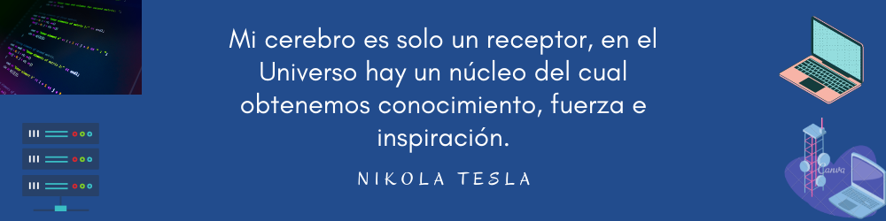

### Hi, welcome to my profile 👋

<h1 align="center">A passionate backend developer from Mexico</h1>


<h3 align="center">Connect with me:</h3>
<p align="center">
<a href="https://twitter.com/@1098miri" target="blank"></a>
<a href="https://linkedin.com/in/linkedin.com/in/miriam9810/" target="blank"></a>
<a href="https://instagram.com/miriam_moraleszam" target="blank"></a>
<a href="https://discord.gg/9102" target="blank"></a>
</p>


``` python
class backdev:
    def __init__(self):
        self.name = "Miriam Zamora Morlaes"
        self.main_profession = "Backend Developer"
        self.base_profession = "Computer Systems Engineer"
        self.python_stack = {
            "🔧 Backend": ["Python", "Django"],
            "📦 Python packages": ["NumPy", "Pandas", "Matplotlib", "Sklearn"],
            "🧵 Miscellaneous": ["Linux", "PostgreSQL", "Docker"],
            "📌 Ongoing": ["Django Rest Framework"]
        }
        self.other_knowledge = {
            "🔧 Other_languages": ["PHP", "HTML", "CSS", "Java", "SQL"],
            "💾 Databases": ["MySQL", "MariaDB"],
            "🧵 Miscellaneous": ["Arduino", "Cisco Packet Tracer"],
        }
        self.tech_communities = ["FrontendCafé", "HackademyMX", "freeCodeCamp (FCC)"]
        self.tech_contribution = ["Python mentor", "Docker mentor"]

    def spend_free_time(self):
        self.courses_in_progress = ["Django Rest Framework"]
        self.next_course = ["Data Science"]
        self.hobbies = ["Ver películas", "K-Dramas"]

    def __str__(self) -> str:
        return f"Actualmente aprendiendo {self.python_stack("📌 Ongoing")[0]}"


me = Developer()
print(me)
```
