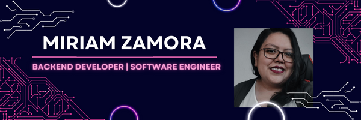

``` python
class Backdev:
    def __init__(self):
        self.name = "Miriam Zamora Morales"
        self.main_profession = "Backend Developer - DRF"
        self.python_stack = {
            "🔧 Backend": ["Python", "Django"],
            "🧵 Miscellaneous": ["Linux", "PostgreSQL"],
            "📌 Ongoing": ["Docker - DevOps"],
            "📰 Article" : ["Tu primer proyecto con Django REST Framework / https://blog.padawan.dev/my-first-project-in-django-rest-framework/"]
        }
        self.other_knowledge = {
            "🔧 Other_languages": ["SQL"],
            "💾 Databases": ["MySQL", "MariaDB", "PostgreSQL"],
            
            "👓 Xtras": 
            "📕 Passions": ["Historia de México", "La segunda Guerra Mundial"],
        }
        self.tech_communities = ["HackademyMX", "HackWomen"]

    def spend_free_time(self):
        self.courses_in_progress = ["Docker - DevOps"]
        self.next_course = ["Data Science"]
        self.hobbies = ["Aprender más sobre Tecnología", "Leer sobre la historia de México"]

    def __str__(self) -> str:
        return f"Actualmente aprendiendo {self.courses_in_progress("📌 Ongoing")[0]}"


me = Backdev()
print(me)
```
------------------------------------------------------------------------------------------------------------


***Aprendido y aplicado por Miriam Zamora Morales***
